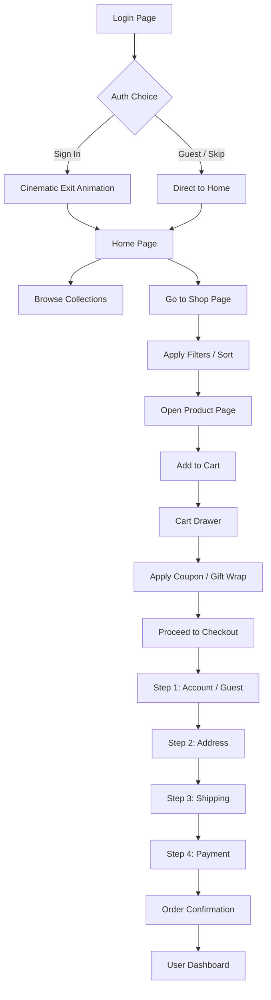

## 1. Product Overview

LUXE — A premium luxury Shopify eCommerce experience designed to rival Apple, Nike, Louis Vuitton, and Tesla. A cinematic, immersive shopping destination with 3D animations, glassmorphism, and award-winning design aesthetics. Delivers unforgettable first impressions while driving conversions with world-class UX.

- Purpose: Redefine luxury eCommerce with premium visual storytelling, motion design, and hyper-interactive interfaces
- Target Users: High-end shoppers, luxury brand enthusiasts, modern consumers who value design and experience
- Market Value: Establishes a new benchmark for premium digital storefronts, elevating brand perception and conversion rates

## 2. Core Features

### 2.1 User Roles

| Role | Registration Method | Core Permissions |
|------|---------------------|------------------|
| Guest Visitor | None (browse only) | Browse products, view catalog, add to cart |
| Customer | Email / Google / Apple / OTP | Full shop access, wishlist, orders, profile, wallet |
| Admin | Secure credentials | Dashboard analytics, product/order/customer management, theme settings |

### 2.2 Feature Module

1. **Login Page**: Cinematic 3D character animation, holographic login panel, magical light effects, floating particles, glassmorphism
2. **Home Page**: Luxury hero with 3D product, animated text, video background, auto-sliding banners, scroll animations, featured collections
3. **Navbar**: Transparent glass navbar, sticky with scroll, animated logo, mega menu, search, wishlist, cart, dark mode, language/currency toggle
4. **Shop Page**: Premium product grid, 3D hover rotation, quick view, quick add, advanced filters/sort, infinite scroll
5. **Product Page**: 360° gallery, zoom, videos, sticky add-to-cart, reviews, FAQs, related/recommended products
6. **Shopping Cart**: Premium cart drawer with animations, coupons, gift wrap, recommendations, shipping calculator
7. **Checkout**: Multi-step with live validation, guest/social login, address autofill, coupon, order summary
8. **User Dashboard**: Orders, wishlist, returns, wallet, rewards, referral, profile, addresses, notifications
9. **Admin Panel**: Analytics dashboard, revenue charts, orders/products/customers/inventory, AI insights, theme settings
10. **Footer**: Animated newsletter, social icons, Instagram feed, floating wave, back-to-top

### 2.3 Page Details

| Page Name | Module Name | Feature Description |
|-----------|-------------|---------------------|
| Login Page | 3D Character Intro | Young man walks from left → center → removes backpack → reveals holographic login panel with glowing magic light |
| Login Page | Holographic Form | Glassmorphism panel with depth-of-field blur, floating particles, 60fps smooth animations |
| Login Page | Post-Login Flow | Character smiles → closes bag → walks away → dashboard opens |
| Home Page | Hero Section | 3D product model, animated gradient text, video background, mouse parallax, auto CTA |
| Home Page | Collections | Auto-sliding cards, 3D tilt on hover, luxury badges, staggered reveal |
| Home Page | Featured Products | Floating cards, quick add, wishlist heart, compare button |
| Home Page | Story Section | Nike-style storytelling, parallax images, large typography |
| Navbar | Glass Navbar | Transparent → blurred on scroll, logo animation, mega menu dropdown |
| Navbar | Controls | Animated search expand, cart badge pulse, wishlist count, theme/language/currency toggles |
| Shop Page | Product Grid | Luxury cards, 3D rotation on hover, image swap, quick view modal |
| Shop Page | Filters | Sidebar with categories, price range, brands, ratings, color swatches |
| Product Page | Gallery | 360 drag, image zoom, video embed, thumbnail slider, AR preview button |
| Product Page | Details | Specifications tabs, review carousel, FAQs accordion, sticky CTA bar |
| Cart Drawer | Premium Cart | Slide-in animation, item quantity stepper, coupon input, gift wrap toggle, recommendations |
| Checkout | Multi-Step | Guest/Login → Address → Shipping → Payment → Confirm, progress bar, live validation |
| Dashboard | Customer Hub | Stats cards, order history table, wishlist grid, wallet/rewards panels, referral link |
| Admin | Control Center | KPI cards, revenue chart, traffic heatmap, order list, product CRUD, AI insights widget |
| Footer | Premium Footer | Aurora gradient bg, wave SVG animation, newsletter glow, social hover, Instagram strip |
| Global | Effects | Custom cursor with glow & trail, floating particles, aurora mesh background, scroll reveal, GSAP/Framer animations |

## 3. Core Process

Visitor lands on Login Page → watches cinematic 3D intro → holographic login panel appears → signs in (or continues as guest via SKIP) → redirected to Home Page → browses hero & collections → navigates to Shop → filters products → opens Product Page → adds to cart → opens cart drawer → applies coupon → proceeds to Checkout → multi-step flow → places order → lands on Confirmation → explores Dashboard.

## 4. User Interface Design

### 4.1 Design Style

- **Primary Colors**: Black (#000000), White (#FFFFFF)
- **Accent Colors**: Royal Blue (#1E40AF), Purple (#7C3AED), Gold (#D4AF37)
- **Signature Gradient**: Blue → Purple → Pink (#1E40AF → #7C3AED → #EC4899)
- **Button Style**: Rounded-xl (16px), glassmorphism with backdrop-blur, subtle border glow, scale + shadow-grow on hover, liquid micro-interactions
- **Typography**:
  - Display: "Playfair Display" (luxury serif) for H1/H2
  - Heading: "Clash Display" (modern geometric) for H3-H6
  - Body: "Inter Tight" (refined sans) 400-600
  - Mono accents: "JetBrains Mono" for prices & codes
- **Layout Style**: Asymmetric luxury grids, overlapping layers, diagonal composition flow, generous 120px vertical section rhythm, card-based with glassy panels
- **Icons / Emojis**: Lucide icons with 1.5px stroke; use tasteful emoji accents in badges only
- **Visual Effects**: Animated gradient mesh background, noise/grain overlay, cursor glow + dot trail, floating dust particles, depth-of-field blur via backdrop-filter, soft multi-layer shadows

### 4.2 Page Design Overview

| Page Name | Module Name | UI Elements |
|-----------|-------------|-------------|
| Login Page | Cinematic Intro | Full black canvas → 3D character SVG walking in (CSS keyframes), luxury backpack, glow burst animation, glass panel expand with DOF blur behind |
| Login Page | Holographic Form | 480x520 card, 24px rounded, backdrop-blur-2xl, gold border glow, animated input lines, floating label, particle canvas bg |
| Home Page | Hero | Full-bleed 1440×900 video bg, 90px Playfair H1 split-animated, 3D product GLB rotating center, mouse parallax layers, dual CTA with liquid hover |
| Home Page | Collections | 4-column floating card grid, 20px radius, 3D tilt on mouse move, overlay gradient, badge with pulse |
| Navbar | Glass Nav | fixed top, h-20, backdrop-blur-xl, border-b with gradient, logo morph animation, mega menu with staggered link reveal |
| Shop Page | Product Card | 320×480, image swap on hover, 3D rotate Y ±8°, quick actions slide up, heart/compare icons, gold rating stars |
| Product Page | Gallery | 70/30 split, 360 drag indicator, zoom lens, thumbnail filmstrip with scroll, AR badge corner |
| Cart Drawer | Slide Panel | 440px wide, slide-in from right with spring, item row with mini image & tilt, total bottom bar with gradient CTA |
| Checkout | Steps | Horizontal progress with glow dot, 800px centered card stack, live field validation with green/red pulse, order summary sticky sidebar |
| Dashboard | Customer | 2-col stats row, order timeline table, wishlist masonry, wallet card with gradient, rewards progress ring |
| Admin | Analytics | 4 stat KPI cards, area chart + bar chart, AI chat bubble floating right, data table with filters |
| Footer | Premium | Aurora gradient mesh SVG, wave path morph animation, newsletter input with sunburst, Instagram row with zoom |
| Global | Cursor | Custom 8px dot + 40px glow ring follow mouse with delay, click ripple, link magnet effect |

### 4.3 Responsiveness

- **Desktop-first** approach; breakpoints at 1280, 1024, 768, 480
- Desktop (1280+): Max 4-col grids, mega-menu inline, full-width hero
- Laptop (1024–1279): 3-col grids, condensed navbar, collapsed mega menu
- Tablet (768–1023): 2-col grids, hamburger menu drawer, stacked product details
- Mobile (480–767): 1–2 col, bottom nav bar, full-width CTAs, touch swipe gallery
- Large Screen (1600+): Max content wrapper 1520px, balanced extra whitespace, richer parallax layers
- Touch optimization: 48px min tap targets, swipe gestures on gallery/cards, long-press quick actions

### 4.4 3D Scene Guidance

- **Environment Mood**: Dark cinematic studio for login; bright luxury showroom with soft window light for home/shop
- **HDRI**: Studio softbox HDRI with warm gold rim; use Three.js RGBELoader
- **Lighting Setup**: 3-point — key (soft area light 45°), fill (cool ambient 0.2), rim (golden parallel light from behind)
- **Camera Settings**: Perspective camera FOV 35°, initial dolly-in on login character; hero uses orbit-controls with auto-rotate disabled, smooth damping
- **Motion**: Character walk cycle (translateX + bob Y), backpack unzip (scale/rotate), glow burst (pointLight intensity anim); 3D products idle float + slow Y rotation
- **Composition**: Login uses rule-of-thirds with character at 1/3 → moves to center; hero product uses centered composition with floating accent objects
- **Post-processing**: Bloom (intensity 0.6), ACES filmic tone mapping, FXAA, slight vignette on login scene
- **Assets & Budget**: Prefer optimized GLTF/GLB from Poly Haven / Sketchfab (≤ 2MB each); fallback to CSS-3D SVG cards if 3D unavailable. Total 3D budget: ≤ 8MB across app.
