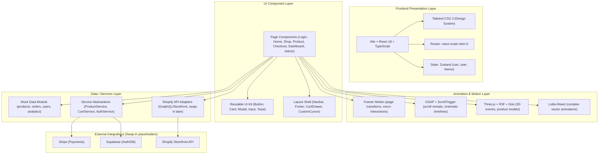
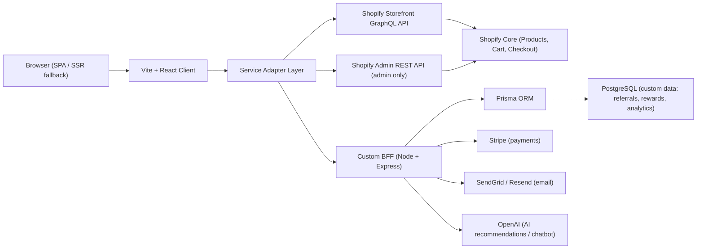
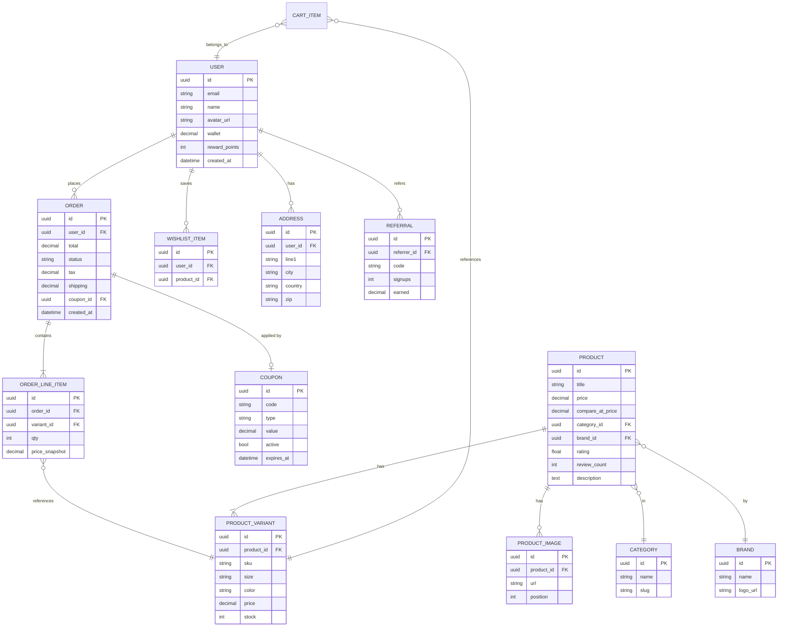

## 1. Architecture Design



## 2. Technology Description

- **Frontend Framework**: React 18 (strict mode, concurrent features) + TypeScript 5 (strict mode)
- **Build Tool**: Vite 5 — fast HMR, code-splitting, optimized rollup build
- **Styling**: Tailwind CSS 3 + tailwindcss-animate + custom design tokens via CSS vars; CSS Modules for localized component styles where needed
- **Routing**: react-router-dom v6 with lazy-loaded route pages
- **State Management**: Zustand 4 (lightweight, redux-free) for cart, user auth, theme, UI state (drawers, modals)
- **Animations**:
  - Framer Motion 11 — page transitions, scroll reveals, micro-interactions (preferred default)
  - GSAP 3 + ScrollTrigger plugin — cinematic hero timelines, complex scroll-linked motion
  - Three.js 0.160 + @react-three/fiber 8 + @react-three/drei 9 + @react-three/postprocessing — 3D login scene + 3D product hero
  - Lottie React — reusable vector animation assets (loader, success, confetti)
- **UI Primitives**: Radix UI primitives (Dialog, Dropdown, Accordion, Toast, Slider) wrapped in styled components for accessibility
- **Icons**: Lucide React (consistent 24px stroke icon set)
- **Charts**: Recharts 2 for admin revenue/traffic charts
- **Forms**: react-hook-form 7 + zod 3 for typed schema validation (checkout, login, admin)
- **Backend / Data**: Mock module with typed fixtures (no backend required for MVP); service layer interfaces designed so Shopify Storefront GraphQL adapter can be swapped in without UI changes
- **Linting / Formatting**: ESLint (react + typescript-eslint) + Prettier (configured via editor defaults)

## 3. Route Definitions

| Route | Purpose | Lazy Chunk |
|-------|---------|------------|
| `/` | Redirect → `/login` or `/home` based on auth | — |
| `/login` | Cinematic login page with 3D character & holographic panel | `LoginPage` |
| `/home` | Luxury homepage (hero, collections, featured, story) | `HomePage` |
| `/shop` | Product catalog with filters, sort, infinite scroll | `ShopPage` |
| `/product/:id` | Product detail (360 gallery, details, reviews, related) | `ProductPage` |
| `/cart` | Full cart page (also accessible via drawer on any page) | `CartPage` |
| `/checkout` | Multi-step checkout flow | `CheckoutPage` |
| `/dashboard` | Customer dashboard (orders, wishlist, wallet, rewards) | `DashboardPage` |
| `/admin` | Admin dashboard (analytics, orders, products, customers, AI) | `AdminPage` |
| `/admin/orders` | Admin orders table + filters | `AdminOrdersPage` |
| `/admin/products` | Admin product CRUD manager | `AdminProductsPage` |
| `/admin/customers` | Admin customer manager | `AdminCustomersPage` |
| `*` | 404 page with luxury aesthetic | `NotFoundPage` |

## 4. API Definitions (Service Abstractions)

Services are typed TypeScript interfaces with mock implementations in `/src/services/mock`. Future Shopify adapters will implement the same interface.

```ts
// src/services/types.ts

export interface Product {
  id: string;
  title: string;
  handle: string;
  price: number;
  compareAtPrice?: number;
  currency: string;
  category: string;
  brand: string;
  tags: string[];
  images: string[];
  video?: string;
  rating: number;
  reviewCount: number;
  stock: number;
  description: string;
  specs: Record<string, string>;
  colors: { name: string; hex: string }[];
  sizes?: string[];
  featured?: boolean;
  isNew?: boolean;
  discountPercent?: number;
}

export interface CartItem {
  productId: string;
  variantId?: string;
  quantity: number;
  size?: string;
  color?: string;
  priceSnapshot: number;
}

export interface User {
  id: string;
  name: string;
  email: string;
  avatar?: string;
  wallet: number;
  rewardPoints: number;
  addresses: Address[];
}

export interface Order {
  id: string;
  items: CartItem[];
  total: number;
  status: 'pending' | 'paid' | 'shipped' | 'delivered' | 'refunded';
  createdAt: string;
  tracking?: string;
}

export interface ProductService {
  list(params: ListParams): Promise<Paged<Product>>;
  get(id: string): Promise<Product | null>;
  related(id: string, limit?: number): Promise<Product[]>;
  featured(limit?: number): Promise<Product[]>;
}

export interface CartService {
  items(): CartItem[];
  add(item: CartItem): void;
  remove(productId: string): void;
  updateQty(productId: string, qty: number): void;
  subtotal(): number;
  applyCoupon(code: string): CouponResult;
  clear(): void;
}

export interface AuthService {
  login(email: string, password: string): Promise<User>;
  loginOtp(email: string, code: string): Promise<User>;
  logout(): void;
  current(): User | null;
  onAuthChange(cb: (u: User | null) => void): () => void;
}
```

Request flow: Component → useStore hook → Service interface → mock implementation → typed fixtures in `/src/fixtures/`.

## 5. Server Architecture Diagram (Future Shopify Integration)



*For this initial build, G–L are mocked on the client. Service layer contract ensures zero UI changes when backends are plugged in.*

## 6. Data Model

### 6.1 Data Model Definition (ER Diagram)



### 6.2 Data Definition Language (DDL — for future Prisma migration reference)

```sql
CREATE TABLE users (
  id UUID PRIMARY KEY DEFAULT gen_random_uuid(),
  email TEXT UNIQUE NOT NULL,
  name TEXT NOT NULL,
  avatar_url TEXT,
  wallet DECIMAL(12,2) NOT NULL DEFAULT 0,
  reward_points INT NOT NULL DEFAULT 0,
  created_at TIMESTAMPTZ NOT NULL DEFAULT NOW()
);

CREATE TABLE categories (id UUID PRIMARY KEY, name TEXT, slug TEXT UNIQUE);
CREATE TABLE brands (id UUID PRIMARY KEY, name TEXT, logo_url TEXT);

CREATE TABLE products (
  id UUID PRIMARY KEY DEFAULT gen_random_uuid(),
  title TEXT NOT NULL,
  handle TEXT UNIQUE NOT NULL,
  price DECIMAL(12,2) NOT NULL,
  compare_at_price DECIMAL(12,2),
  category_id UUID REFERENCES categories(id),
  brand_id UUID REFERENCES brands(id),
  rating FLOAT NOT NULL DEFAULT 0,
  review_count INT NOT NULL DEFAULT 0,
  description TEXT NOT NULL DEFAULT '',
  featured BOOLEAN NOT NULL DEFAULT FALSE,
  is_new BOOLEAN NOT NULL DEFAULT FALSE
);

CREATE TABLE product_variants (
  id UUID PRIMARY KEY,
  product_id UUID NOT NULL REFERENCES products(id) ON DELETE CASCADE,
  sku TEXT UNIQUE,
  size TEXT,
  color TEXT,
  price DECIMAL(12,2),
  stock INT NOT NULL DEFAULT 0
);

CREATE TABLE product_images (
  id UUID PRIMARY KEY,
  product_id UUID NOT NULL REFERENCES products(id) ON DELETE CASCADE,
  url TEXT NOT NULL,
  position INT NOT NULL DEFAULT 0
);

CREATE TABLE addresses (
  id UUID PRIMARY KEY, user_id UUID NOT NULL REFERENCES users(id) ON DELETE CASCADE,
  line1 TEXT, city TEXT, country TEXT, zip TEXT
);

CREATE TABLE coupons (
  id UUID PRIMARY KEY, code TEXT UNIQUE NOT NULL, type TEXT NOT NULL,
  value DECIMAL(12,2) NOT NULL, active BOOLEAN NOT NULL DEFAULT TRUE,
  expires_at TIMESTAMPTZ
);

CREATE TABLE orders (
  id UUID PRIMARY KEY, user_id UUID REFERENCES users(id),
  total DECIMAL(12,2) NOT NULL, status TEXT NOT NULL,
  tax DECIMAL(12,2) NOT NULL DEFAULT 0, shipping DECIMAL(12,2) NOT NULL DEFAULT 0,
  coupon_id UUID REFERENCES coupons(id), created_at TIMESTAMPTZ NOT NULL DEFAULT NOW()
);

CREATE TABLE order_line_items (
  id UUID PRIMARY KEY, order_id UUID NOT NULL REFERENCES orders(id) ON DELETE CASCADE,
  variant_id UUID NOT NULL REFERENCES product_variants(id),
  qty INT NOT NULL CHECK (qty > 0), price_snapshot DECIMAL(12,2) NOT NULL
);

CREATE TABLE wishlist_items (
  id UUID PRIMARY KEY, user_id UUID NOT NULL REFERENCES users(id) ON DELETE CASCADE,
  product_id UUID NOT NULL REFERENCES products(id) ON DELETE CASCADE,
  UNIQUE(user_id, product_id)
);

CREATE TABLE referrals (
  id UUID PRIMARY KEY, referrer_id UUID NOT NULL REFERENCES users(id),
  code TEXT UNIQUE NOT NULL, signups INT NOT NULL DEFAULT 0,
  earned DECIMAL(12,2) NOT NULL DEFAULT 0
);

CREATE INDEX idx_products_category ON products(category_id);
CREATE INDEX idx_products_brand ON products(brand_id);
CREATE INDEX idx_orders_user ON orders(user_id);
CREATE INDEX idx_orders_status ON orders(status);
```

## 7. Module / Folder Structure

```
src/
├── assets/                # Static assets, fonts, Lottie files, HDRIs
├── components/
│   ├── ui/                # Primitive reusable components (Button, Card, Input, Modal, Toast…)
│   ├── layout/            # Navbar, Footer, CartDrawer, CustomCursor, ThemeToggle, ParticlesBg
│   ├── shop/              # ProductCard, ProductGrid, FilterSidebar, QuickView, RatingStars…
│   ├── home/              # Hero, Collections, StorySection, FeaturedProducts
│   ├── login/             # CharacterScene, HoloPanel, ParticleCanvas
│   ├── dashboard/         # StatsCard, OrderTable, WishlistGrid, WalletCard
│   ├── admin/             # KPICard, RevenueChart, OrderManager, ProductEditor
│   └── checkout/          # StepProgress, AddressForm, PaymentForm, OrderSummary
├── hooks/                 # useScrollReveal, useMouseParallax, useGsapTimeline, useTheme
├── lib/                   # utils, design-tokens, motion-variants, formatters
├── fixtures/              # Typed JSON mock data (products, categories, orders…)
├── services/
│   ├── types.ts           # Shared interfaces
│   └── mock/              # productService.mock.ts, authService.mock.ts, cartService.mock.ts
├── stores/                # Zustand stores: useAuthStore, useCartStore, useUIStore, useThemeStore
├── pages/                 # Route components (lazy loaded)
│   ├── LoginPage.tsx
│   ├── HomePage.tsx
│   ├── ShopPage.tsx
│   ├── ProductPage.tsx
│   ├── CartPage.tsx
│   ├── CheckoutPage.tsx
│   ├── DashboardPage.tsx
│   ├── AdminPage.tsx
│   └── NotFoundPage.tsx
├── router.tsx             # Route definitions with lazy loading + auth guards
├── App.tsx                # Root shell + global providers (Router, Motion, Theme, Toasts, Cursor, Particles)
├── main.tsx               # Entry + React.StrictMode
├── index.css              # Tailwind layers + design tokens CSS vars + global styles
└── vite-env.d.ts
```
